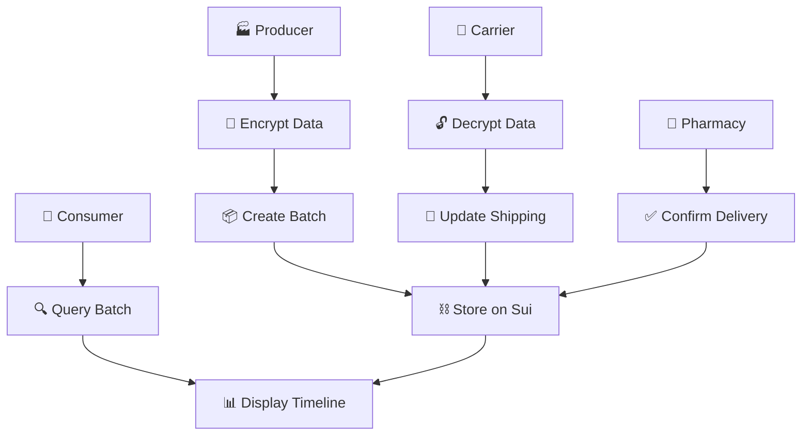

# MedTrack - Hệ Thống Quản Lý Chuỗi Cung Ứng Thuốc Blockchain

<div align="center">
  
  
  
  
  
</div>

## 📋 Mục Lục

- [🎯 Tổng Quan](#-tổng-quan)
- [✨ Tính Năng Chính](#-tính-năng-chính)
- [🏗️ Kiến Trúc Hệ Thống](#️-kiến-trúc-hệ-thống)
- [🚀 Cài Đặt & Chạy](#-cài-đặt--chạy)
- [📖 Hướng Dẫn Sử Dụng](#-hướng-dẫn-sử-dụng)
- [🔧 Phát Triển](#-phát-triển)
- [🔐 Bảo Mật](#-bảo-mật)
- [🧪 Testing](#-testing)
- [📚 API Documentation](#-api-documentation)
- [🤝 Đóng Góp](#-đóng-góp)
- [📄 License](#-license)

---

## 🎯 Tổng Quan

**MedTrack** là hệ thống quản lý chuỗi cung ứng thuốc tiên tiến sử dụng công nghệ blockchain Sui, đảm bảo tính minh bạch, bảo mật và truy xuất nguồn gốc 100% từ nhà sản xuất đến người tiêu dùng.

### 🎯 Mục Tiêu
- ✅ **Minh bạch tuyệt đối**: Mọi giao dịch được ghi trên blockchain
- 🔒 **Bảo mật cao**: Mã hóa thông tin nhạy cảm với TweetNaCl
- 🔍 **Truy xuất tức thời**: Tra cứu hành trình thuốc chỉ với 1 click
- 📱 **Trải nghiệm tối ưu**: Giao diện thân thiện, responsive
- ⚡ **Hiệu suất vượt trội**: Sử dụng Sui - blockchain nhanh nhất

### 🎯 Quy Trình Hoạt Động

```
🏭 Producer → 🚚 Carrier → 🏥 Pharmacy → 👥 Consumer
     ↓         ↓         ↓         ↓
  Tạo đơn   Cập nhật   Nhận hàng  Tra cứu
  hàng      vận chuyển  hoàn tất   hành trình
```

---

## ✨ Tính Năng Chính

### 🏭 Nhà Sản Xuất (Producer)
- **Tạo đơn hàng** với mã hóa thông tin nhạy cảm
- **Mã thuốc chuẩn**: `PTS-2025-12` (Paracetamol-2025-tháng 12)
- **Bảo mật tối đa**: Địa chỉ & số điện thoại được mã hóa
- **Real-time tracking**: Theo dõi trạng thái đơn hàng

### 🚚 Đơn Vị Vận Chuyển (Carrier)
- **Key pair generation**: Tạo cặp khóa công khai/bí mật tự động
- **Giải mã thông tin**: Truy cập địa chỉ giao hàng an toàn
- **Location tracking**: Cập nhật vị trí vận chuyển real-time
- **Status updates**: Thông báo trạng thái cho tất cả bên liên quan

### 🏥 Nhà Thuốc (Pharmacy)
- **Nhận hàng tức thì**: Xác nhận nhận hàng với 1 click
- **Thông tin đầy đủ**: Lưu trữ tên nhà thuốc & thông tin liên hệ
- **Delivery confirmation**: Hoàn tất chuỗi cung ứng
- **Inventory management**: Tích hợp quản lý tồn kho

### 🔍 Tra Cứu Hành Trình (Tracking)
- **Batch ID lookup**: Tìm kiếm nhanh chóng theo ID lô thuốc
- **Visual timeline**: Hiển thị hành trình với giao diện trực quan
- **Contact information**: Thông tin liên hệ tại mỗi bước
- **QR Code support**: Quét mã để tra cứu nhanh

---

## 🏗️ Kiến Trúc Hệ Thống

### 📁 Cấu Trúc Dự Án

```
MedTrack/
├── medtrack/                    # 🏗️ Smart Contract (Move)
│   ├── sources/
│   │   └── supply_chain.move    # Logic chính của hệ thống
│   ├── tests/                   # 🧪 Unit tests
│   ├── Move.toml               # ⚙️ Dependencies & config
│   └── Move.lock               # 🔒 Lock file
│
├── medtrack-fe/                 # 🎨 Frontend (React + TypeScript)
│   ├── public/                  # 📁 Static assets
│   ├── src/
│   │   ├── components/          # 🧩 Reusable components
│   │   ├── pages/               # 📄 Main pages
│   │   │   ├── ProducerPage.tsx # 🏭 Trang nhà sản xuất
│   │   │   ├── CarrierPage.tsx  # 🚚 Trang vận chuyển
│   │   │   ├── PharmacyPage.tsx # 🏥 Trang nhà thuốc
│   │   │   └── TrackingPage.tsx # 🔍 Trang tra cứu
│   │   ├── utils/               # 🛠️ Utilities
│   │   ├── constants.ts         # ⚙️ App configuration
│   │   ├── App.tsx             # 🎯 Main app component
│   │   └── main.tsx            # 🚀 Entry point
│   ├── package.json            # 📦 Dependencies
│   ├── tailwind.config.ts      # 🎨 Styling config
│   ├── vite.config.ts          # ⚡ Build config
│   └── tsconfig.json           # 📝 TypeScript config
│
├── .git/                       # 📚 Version control
├── README.md                   # 📖 This file
├── USER_FLOW.md                # 👥 User flow documentation
└── README_COMPLETE.md          # 📚 Detailed documentation
```

### 🔄 Luồng Dữ Liệu



### 💻 Công Nghệ Sử Dụng

#### 🎨 Frontend Stack
- **React 19** - Latest React with modern features
- **TypeScript** - Type-safe development
- **Tailwind CSS** - Utility-first CSS framework
- **Sui dApp Kit** - Official Sui blockchain integration
- **Vite** - Lightning-fast build tool & dev server
- **React Router** - Client-side routing

#### ⛓️ Blockchain Stack
- **Sui Network** - High-performance Layer 1 blockchain
- **Move Language** - Resource-oriented programming language
- **Sui CLI** - Development & deployment tools
- **TweetNaCl** - Cryptographic operations

#### 🔐 Security & Validation
- **Wallet Authorization** - Whitelist-based access control
- **Input Sanitization** - Comprehensive validation
- **Cryptographic Security** - End-to-end encryption
- **Audit Trail** - Complete transaction history

---

## 🚀 Cài Đặt & Chạy

### 📋 Yêu Cầu Hệ Thống

- **Node.js**: 18.0.0 hoặc cao hơn
- **Sui CLI**: Latest version
- **Git**: For version control
- **Browser**: Chrome/Firefox với Sui Wallet extension

### ⚡ Chạy Nhanh (Quick Start)

```bash
# 1. Clone repository
git clone <repository-url>
cd MedTrack

# 2. Cài đặt dependencies cho frontend
cd medtrack-fe
npm install

# 3. Chạy development server
npm run dev

# 4. Mở browser và truy cập
# http://localhost:5173/
```

### 🏗️ Setup Chi Tiết

#### Backend (Smart Contract)
```bash
# 1. Build smart contract
cd medtrack
sui move build

# 2. Deploy to testnet
sui client publish --gas-budget 200000000

# 3. Update PACKAGE_ID trong constants.ts
```

#### Frontend
```bash
# 1. Install dependencies
cd medtrack-fe
npm install

# 2. Start development server
npm run dev

# 3. Build for production
npm run build
```

### 🔧 Environment Configuration

Tạo file `.env.local` trong thư mục `medtrack-fe/`:

```env
# Network configuration
VITE_NETWORK=testnet

# Smart contract addresses
VITE_PACKAGE_ID=0xb7041c6d6d14f8dafeebc61604643ea031a06540a0201bc864835bae28980ccb
VITE_MODULE_NAME=supply_chain

# Feature flags
VITE_ENABLE_DEBUG=true
```

---

## 📖 Hướng Dẫn Sử Dụng

### 🔑 Chuẩn Bị Ban Đầu

1. **Cài đặt Sui Wallet**
   - Tải Sui Wallet extension
   - Tạo hoặc import ví
   - Đảm bảo có đủ SUI testnet

2. **Kết nối ứng dụng**
   - Truy cập http://localhost:5173/
   - Click "Connect Wallet"
   - Chọn ví và approve

3. **Kiểm tra ủy quyền**
   - Địa chỉ ví phải có trong danh sách cho phép
   - Liên hệ admin nếu chưa được ủy quyền

### 🏭 Quy Trình Tạo Đơn Hàng

#### Bước 1: Truy cập Producer Page
```
URL: http://localhost:5173/#/producer
```

#### Bước 2: Nhận Public Key từ Carrier
- Carrier tạo key pair và gửi Public Key
- Producer paste Public Key vào form

#### Bước 3: Điền thông tin
- **Mã thuốc**: `PTS-2025-12`
- **Tên công ty**: `Công ty Dược phẩm ABC`
- **Số điện thoại**: `0896739545`
- **Công ty nhận**: `Nhà thuốc XYZ`
- **Địa chỉ giao**: `123 Đường ABC, Phường DEF...`
- **Số điện thoại nhận**: `0987654321`

#### Bước 4: Tạo đơn hàng
- Click "🔒 Mã hóa & Gửi lên Blockchain"
- Approve transaction trong ví
- Nhận Batch ID

### 🚚 Quy Trình Vận Chuyển

#### Bước 1: Tạo Key Pair
```
URL: http://localhost:5173/#/carrier
```
- Click "🆕 Tạo Cặp Khóa Mới"
- **Quan trọng**: Lưu Private Key vào nơi an toàn
- Copy Public Key gửi cho Producer

#### Bước 2: Nhận đơn hàng
- Nhận Batch ID từ Producer
- Paste vào form và giải mã

#### Bước 3: Cập nhật vận chuyển
- Điền thông tin vận chuyển
- Click "📦 Xác Nhận Đang Giao Hàng"

### 🏥 Quy Trình Nhận Hàng

#### Bước 1: Truy cập Pharmacy Page
```
URL: http://localhost:5173/#/pharmacy
```

#### Bước 2: Xác nhận nhận hàng
- **Batch ID**: Từ Producer/Carrier
- **Tên nhà thuốc**: `Nhà thuốc ABC`
- **Số điện thoại**: `0987654321`

#### Bước 3: Hoàn tất
- Click "✅ Xác nhận đã nhận đơn hàng"

### 🔍 Tra Cứu Hành Trình

#### Bước 1: Truy cập Tracking Page
```
URL: http://localhost:5173/#/tracking
```

#### Bước 2: Tìm kiếm
- Paste Batch ID
- Click "🔍 Tìm"

#### Bước 3: Xem kết quả
- Timeline đầy đủ của lô thuốc
- Thông tin liên hệ tại mỗi bước
- Trạng thái hiện tại

---

## 🔧 Phát Triển

### 🏗️ Development Workflow

```bash
# 1. Setup development environment
npm install

# 2. Start development server with hot reload
npm run dev

# 3. Run linting
npm run lint

# 4. Build for production
npm run build

# 5. Preview production build
npm run preview
```

### 📝 Available Scripts

```json
{
  "scripts": {
    "dev": "vite",                    // Development server
    "build": "tsc && vite build",     // Production build
    "lint": "eslint . --ext ts,tsx",  // Code linting
    "preview": "vite preview",        // Preview production build
    "type-check": "tsc --noEmit"      // Type checking
  }
}
```

### 🔄 Smart Contract Development

```bash
# Build contract
cd medtrack
sui move build

# Run tests
sui move test

# Publish to testnet
sui client publish --gas-budget 200000000

# Verify deployment
sui client object <PACKAGE_ID>
```

### 🧩 Component Structure

```
src/
├── components/          # Reusable UI components
├── pages/              # Page components
├── utils/              # Helper functions
├── constants.ts        # Configuration
├── App.tsx            # Main app
└── main.tsx           # Entry point
```

---

## 🔐 Bảo Mật

### 👛 Wallet Authorization

Chỉ các ví được liệt kê mới được phép sử dụng:

```typescript
export const ALLOWED_WALLETS = [
  "0x915342dba62fb2dceb7405a22fe19e0e3627bedbe9bca822c0b3464546e312b3", // Admin
  "0x90eb4ce69bf7fc934f8e8bd688d2da7bc8916a8a30358bb568aa6087efe89a50", // Authorized
];
```

### 🔒 Mã Hóa Dữ Liệu

- **Thuật toán**: TweetNaCl (X25519 key exchange)
- **Thông tin nhạy cảm**: Địa chỉ giao hàng, số điện thoại
- **Truy cập**: Chỉ Carrier với Private Key mới giải mã

### ✅ Validation Rules

- **Mã thuốc**: Regex `^[A-Za-z]{2,4}-\d{4}-\d{2}$`
- **Số điện thoại**: Format Việt Nam `0xxxxxxxxx` hoặc `+84xxxxxxxxx`
- **Batch ID**: Hex format `0x[64 ký tự hex]`
- **Địa chỉ**: Ít nhất 10 ký tự, đầy đủ thông tin

---

## 🧪 Testing

### 🏃‍♂️ Chạy Tests

```bash
# Frontend tests
cd medtrack-fe
npm test

# Smart contract tests
cd medtrack
sui move test
```

### 🧪 Test Coverage

- **Unit Tests**: Component logic
- **Integration Tests**: Blockchain interactions
- **E2E Tests**: Complete user workflows
- **Security Tests**: Authorization & encryption

---

## 📚 API Documentation

### 🎯 Smart Contract Functions

#### `create_record`
```move
entry fun create_record(
    medicine_code: String,
    manufacturer: String,
    producer_phone: String,
    receiver_company: String,
    info: String,
    clock: &Clock,
    ctx: &mut TxContext
)
```

#### `update_record_shipping`
```move
entry fun update_record_shipping(
    batch: &mut MedicineBatch,
    carrier_name: String,
    carrier_phone: String,
    delivery_location: String,
    clock: &Clock,
    ctx: &mut TxContext
)
```

#### `complete_record_delivery`
```move
entry fun complete_record_delivery(
    batch: &mut MedicineBatch,
    pharmacy_name: String,
    pharmacy_phone: String,
    pharmacy_location: String,
    clock: &Clock,
    ctx: &mut TxContext
)
```

### 📊 Data Structures

#### `MedicineBatch`
```move
public struct MedicineBatch has key {
    id: UID,
    medicine_code: String,
    current_status: u8,
    history: vector<ID>,
}
```

#### `StatusRecord`
```move
public struct StatusRecord has key {
    id: UID,
    batch_id: ID,
    status: u8,
    actor: address,
    location_info: String,
    phone: String,
    timestamp: u64,
    note: String
}
```

---

## 🤝 Đóng Góp

Chúng tôi hoan nghênh mọi đóng góp! Vui lòng đọc [CONTRIBUTING.md](CONTRIBUTING.md) để biết chi tiết.

### 📋 Development Process

1. **Fork** repository
2. **Create** feature branch (`git checkout -b feature/AmazingFeature`)
3. **Commit** changes (`git commit -m 'Add some AmazingFeature'`)
4. **Push** to branch (`git push origin feature/AmazingFeature`)
5. **Open** Pull Request

### 🐛 Bug Reports & Feature Requests

- **Issues**: [GitHub Issues](https://github.com/your-repo/issues)
- **Discussions**: [GitHub Discussions](https://github.com/your-repo/discussions)
- **Email**: contact@medtrack.dev

---

## 📄 License

This project is licensed under the MIT License - see the [LICENSE](LICENSE) file for details.

---

## 🙏 Acknowledgments

- **Sui Foundation** - For the amazing blockchain infrastructure
- **Move Language** - For the secure smart contract language
- **React Community** - For the excellent frontend framework
- **Open Source Community** - For the countless tools and libraries

---

<div align="center">

**🎉 MedTrack - Nâng Tầm An Toàn Thuốc Cho Tương Lai!**

*Built with ❤️ for a safer pharmaceutical supply chain*

---

*Last updated: December 2025*  
*Version: 1.0.0*

</div>
